# Data Model

This document describes the D1 relational schema and the Durable Objects
state schema as of v0.64.0. It fulfills SaaS extension acceptance criterion §16.7.

## Architecture: D1 vs Durable Objects

cesauth splits state into two stores with different consistency properties:

| Store | Contents | Consistency |
|---|---|---|
| **D1 (SQLite)** | Long-lived relational truth: tenants, users, roles, audit events | Eventual (global), strongly consistent within a region |
| **Durable Objects** | Sequential ephemeral state: auth challenges, sessions, refresh families, rate limits | Strongly consistent (single actor per key) |

The boundary is intentional. D1 holds "what happened and who has permission";
DOs hold "what is happening right now and how many times has it happened this second."

---

## D1 Entity-Relationship Diagram

```mermaid
erDiagram
    tenants {
        TEXT id PK
        TEXT slug UK
        TEXT display_name
        TEXT status
        INTEGER created_at
        INTEGER updated_at
    }

    users {
        TEXT id PK
        TEXT tenant_id FK
        TEXT email
        TEXT account_type
        INTEGER created_at
        INTEGER updated_at
    }

    authenticators {
        TEXT id PK
        TEXT user_id FK
        TEXT tenant_id FK
        TEXT credential_id
        TEXT cose_key
        INTEGER sign_count
        TEXT transports
        INTEGER created_at
        INTEGER last_used_at
    }

    user_tenant_memberships {
        TEXT id PK
        TEXT user_id FK
        TEXT tenant_id FK
        TEXT status
        INTEGER joined_at
    }

    user_organization_memberships {
        TEXT id PK
        TEXT user_id FK
        TEXT organization_id FK
        INTEGER joined_at
    }

    user_group_memberships {
        TEXT id PK
        TEXT user_id FK
        TEXT group_id FK
        INTEGER joined_at
    }

    organizations {
        TEXT id PK
        TEXT tenant_id FK
        TEXT slug
        TEXT display_name
        TEXT status
        INTEGER created_at
    }

    groups {
        TEXT id PK
        TEXT tenant_id FK
        TEXT organization_id FK
        TEXT slug
        TEXT display_name
        INTEGER created_at
    }

    roles {
        TEXT id PK
        TEXT tenant_id FK
        TEXT slug
        TEXT display_name
        TEXT permissions
        INTEGER created_at
        INTEGER updated_at
    }

    permissions {
        TEXT id PK
        TEXT slug UK
        TEXT description
        INTEGER created_at
    }

    role_assignments {
        TEXT id PK
        TEXT user_id FK
        TEXT role_id FK
        TEXT scope_type
        TEXT scope_id
        TEXT granted_by FK
        INTEGER granted_at
        INTEGER expires_at
    }

    plans {
        TEXT id PK
        TEXT slug UK
        TEXT display_name
        INTEGER active
        TEXT features
        TEXT quotas
        TEXT price_description
    }

    subscriptions {
        TEXT id PK
        TEXT tenant_id FK
        TEXT plan_id FK
        TEXT status
        INTEGER trial_ends_at
        INTEGER current_period_start
        INTEGER current_period_end
        INTEGER created_at
        INTEGER updated_at
    }

    subscription_history {
        TEXT id PK
        TEXT subscription_id FK
        TEXT old_plan_id
        TEXT new_plan_id
        TEXT reason
        INTEGER changed_at
        TEXT changed_by
    }

    oidc_clients {
        TEXT id PK
        TEXT tenant_id FK
        TEXT client_id UK
        TEXT client_secret_hash
        TEXT redirect_uris
        TEXT grant_types
        TEXT response_types
        TEXT scopes
        TEXT audience
        INTEGER created_at
        INTEGER updated_at
    }

    consent {
        TEXT id PK
        TEXT user_id FK
        TEXT client_id FK
        TEXT scope
        INTEGER granted_at
        INTEGER expires_at
    }

    grants {
        TEXT id PK
        TEXT user_id FK
        TEXT client_id FK
        TEXT scope
        INTEGER granted_at
    }

    totp_credentials {
        TEXT id PK
        TEXT user_id FK
        TEXT encrypted_secret
        INTEGER created_at
        TEXT recovery_codes
    }

    audit_events {
        INTEGER seq PK
        TEXT id
        INTEGER ts
        TEXT kind
        TEXT actor_id
        TEXT subject
        TEXT client_id
        TEXT reason
        TEXT chain_hash
        TEXT request_id
    }

    user_sessions {
        TEXT id PK
        TEXT user_id FK
        TEXT tenant_id FK
        INTEGER created_at
        INTEGER last_seen_at
    }

    invitation_tokens {
        TEXT id PK
        TEXT tenant_id FK
        TEXT email
        TEXT role
        TEXT issued_by FK
        INTEGER issued_at
        INTEGER expires_at
        INTEGER accepted_at
        TEXT accepted_by
        INTEGER revoked_at
        TEXT revoked_by
    }

    deletion_requests {
        TEXT id PK
        TEXT tenant_id FK
        TEXT user_id FK
        TEXT status
        INTEGER scheduled_at
        INTEGER executed_at
        TEXT executed_by
        INTEGER cancelled_at
        TEXT cancelled_by
    }

    schema_meta {
        TEXT key PK
        TEXT value
    }

    tenants ||--o{ users : "has"
    tenants ||--o{ organizations : "has"
    tenants ||--o{ groups : "parent"
    tenants ||--o{ oidc_clients : "owns"
    tenants ||--o{ subscriptions : "has one active"
    tenants ||--o{ invitation_tokens : "issues"
    tenants ||--o{ deletion_requests : "manages"
    users ||--o{ authenticators : "registers"
    users ||--o{ user_tenant_memberships : "belongs via"
    users ||--o{ user_organization_memberships : "belongs via"
    users ||--o{ user_group_memberships : "belongs via"
    users ||--o{ role_assignments : "assigned via"
    users ||--o{ consent : "grants"
    users ||--o{ grants : "holds"
    users ||--o{ totp_credentials : "may have"
    users ||--o{ user_sessions : "has"
    organizations ||--o{ user_organization_memberships : "members via"
    organizations ||--o{ groups : "sub-groups"
    groups ||--o{ user_group_memberships : "members via"
    roles ||--o{ role_assignments : "assigned via"
    plans ||--o{ subscriptions : "defines"
    subscriptions ||--o{ subscription_history : "history via"
    oidc_clients ||--o{ consent : "subject of"
    oidc_clients ||--o{ grants : "subject of"
```

---

## Durable Object State

| DO Class | Key | Contents | Retention |
|---|---|---|---|
| `AuthChallenge` | `challenge:{handle}` | PKCE code, CSRF token, session context | 10 min TTL |
| `ActiveSession` | `session:{session_id}` | User ID, tenant ID, refresh token family ref, last-seen | Session lifetime |
| `RefreshTokenFamily` | `family:{family_id}` | Token chain, reuse detection, rotation state | Refresh lifetime |
| `MagicLinkChallenge` | `magic:{handle}` | Email, OTP hash, attempt count | 30 min TTL |
| `UserSessionIndex` | `usi:{user_id}` | List of `session_id` for a user | Per-session entry TTL |
| `RateLimit` | `rl:{key}` | Sliding window counters | 1 hr TTL |

---

## Tenant Isolation

Every table that contains user or content data carries a `tenant_id` foreign key.
The following invariants are enforced:

1. **API layer**: all authenticated routes resolve `tenant_id` from the session token;
   queries are always filtered to that tenant.
2. **Service layer**: `authz::check_permission` evaluates the scope lattice, ensuring
   system-scope grants cannot be used to access tenant data unless the caller is
   actually system-scoped.
3. **Migration layer**: composite unique indexes (`0013_tenant_composite_keys.sql`)
   prevent slug collisions across tenants (e.g. two different tenants can both have
   an org with slug `engineering`).
4. **FK cascade**: `ON DELETE CASCADE` on user-owned data ensures that deleting a
   user removes all their authenticators, sessions, consents, and grants within their
   tenant. `0012_user_fk_cascades.sql` and `0016_repair_legacy_0004_fk_and_collation.sql`
   corrected early-migration omissions.

---

## Plan and Subscription Separation

`plans` is the static catalogue (feature flags, quotas, pricing description).
`subscriptions` is the live contract (current plan, trial end, billing period).
`subscription_history` records every plan change with actor and reason.

This separation allows:
- Plan definitions to change without touching existing subscriptions.
- A tenant to be on Trial while the `plans.trial` row is updated for new sign-ups.
- Retroactive reporting on "how many tenants were on plan X at time T".

---

## Migration History

| Migration | Version | Purpose |
|---|---|---|
| 0001 | v0.4.0 | Initial schema: users, OIDC, consent, grants, audit |
| 0002 | v0.4.0 | Admin console tables |
| 0003 | v0.20.0 | Tenancy: tenant, org, group, membership, plan, subscription |
| 0004 | v0.20.0 | User-tenancy backfill (data migration) |
| 0005 | v0.25.0 | Admin token ↔ user link |
| 0006 | v0.16.0 | Anonymous trial accounts |
| 0007 | v0.28.0 | TOTP credentials |
| 0008 | v0.32.0 | Audit event hash chain (ADR-010) |
| 0009 | v0.35.0 | User session index for `/me/security/sessions` |
| 0010 | v0.44.0 | Introspection audience column on OIDC clients |
| 0011 | v0.46.0 | Permission catalog sync (tenant:member:add/remove) |
| 0012 | v0.47.0 | User FK CASCADE corrections |
| 0013 | v0.48.0 | Tenant composite unique keys |
| 0014 | v0.50.0 | Index restoration after 0004 regression |
| 0015 | v0.51.0 | Audit event request_id column |
| 0016 | v0.52.0 | Repair legacy 0004 FK and COLLATE NOCASE |
| 0017 | v0.54.0 | Groups FK RESTRICT on delete |
| 0018 | v0.57.0 | Invitation tokens |
| 0019 | v0.58.0 | Deletion requests |
| 0020 | v0.61.0 | Authenticator tenant_id column |

---

*See also: [Architecture](architecture.md) · [ADR-010 Audit Chain](adrs/010-audit-chain.md)*
